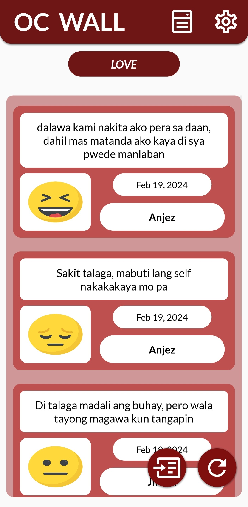
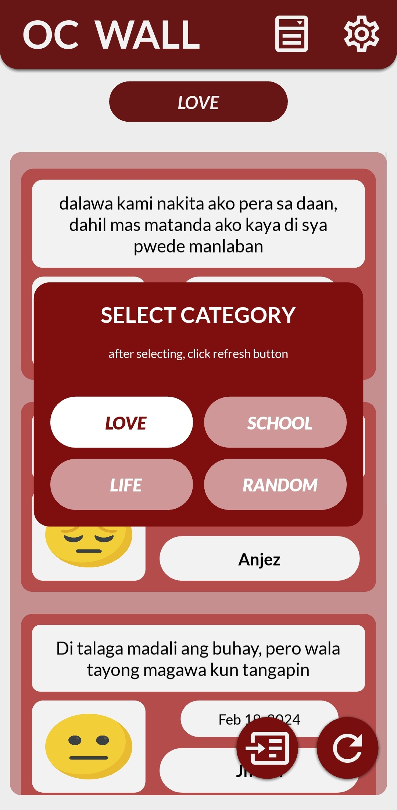

# OC Wall

## Description
OC Wall is a mobile application similar to Facebook, but with an anonymous twist. Users can freely express their thoughts and feelings without revealing their identity. However, to maintain a positive and safe environment, all posts undergo filtering by our application manager to ensure they comply with community guidelines. This online platform requires an internet connection for access.

## Usage
Simply launch the app and choose a theme that interests you (e.g., love, school, random, or life). Explore the thoughts shared by users on each theme and engage freely.

## Images
### Main Home of Application

### Developer Information

### Theme Selections of Application

## Technology Stack
- **Programming Language:** Python
- **Framework:** Kivy and Kivymd

## Installation
While OC Wall is not available as a standalone Android or iOS app due to security reasons, it can be packaged into a mobile application using Buildozer.
