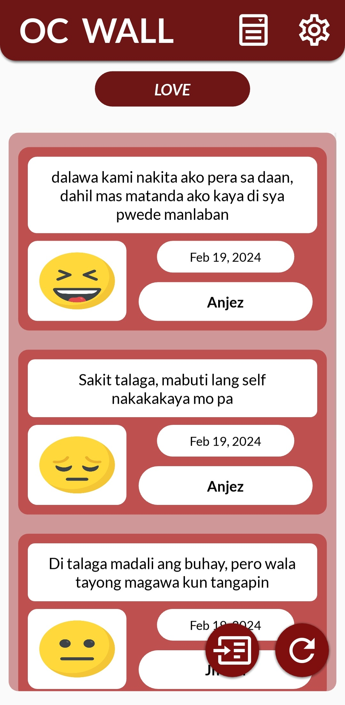
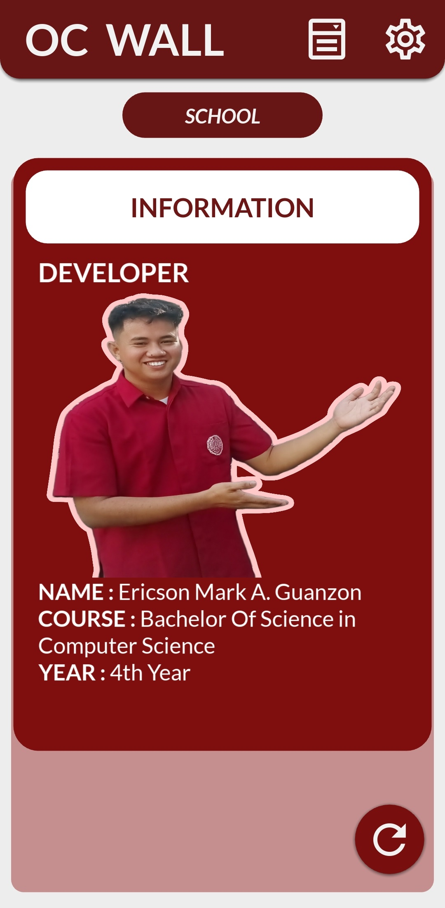
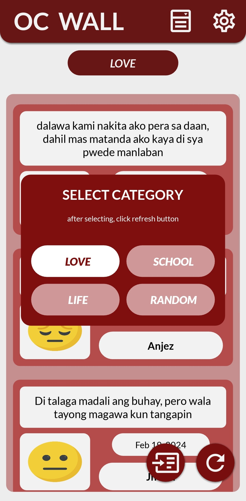

**OC Wall** is a mobile application inspired by social media platforms like Facebook, but designed with **complete anonymity**.

The goal of the app is to allow users to **freely express their thoughts and emotions** without revealing their identity, while maintaining a **safe and moderated community environment**.

Users can explore posts based on different themes such as:

* Love
* School
* Life
* Random Thoughts

To ensure a positive environment, posts are **reviewed and filtered by the application manager** before appearing publicly.

This project demonstrates how **Python can be used to build cross-platform mobile applications using Kivy and KivyMD.**

---

# 🛠 Technologies Used

The project was built using the following technologies:

### Programming Language

* **Python**

### Mobile Framework

* **Kivy**
* **KivyMD**

### Mobile Build Tools

* **python-for-android**
* **Kivy iOS**

### Development Environment

* **Linux**
* **Google Colab**

### Other Concepts

* Mobile UI/UX Design
* Client-server communication
* Content moderation workflow

---

# ⚙️ Development Process

This project was built through the following steps:

### 1. Concept Design

The initial idea was to create a **safe anonymous platform** where users could share thoughts without identity exposure.

### 2. UI Design

Using **KivyMD**, I created a **Material Design inspired mobile interface** that is clean and simple for users.

### 3. Theme-based Content Structure

Posts were organized into different **topic categories** (love, school, life, random) to make browsing easier.

### 4. Moderation System

A filtering process was implemented to ensure that posts follow community guidelines before being published.

### 5. Mobile Build Setup

The application was compiled for Android using:

* **python-for-android**
* **Linux development environment**

### 6. Testing

The app was tested to ensure:

* UI responsiveness
* Post submission flow
* Theme browsing

---

# 📚 What I Learned

During this project, I gained experience in:

* Building **mobile applications using Python**
* Designing **mobile UI using KivyMD**
* Structuring a **content-based application**
* Managing **project dependencies and builds**
* Using **Linux as a development environment**
* Understanding **cross-platform mobile development**

---

# 🚀 Overall Growth

This project helped me improve in several areas:

* Mobile application architecture
* Python framework usage
* UI/UX design thinking
* Debugging cross-platform builds
* Independent project development

It also strengthened my ability to **turn an idea into a working mobile application** using open-source technologies.

---

# 🔧 Possible Improvements

Future improvements could include:

* Real-time backend integration
* User reaction system (likes or comments)
* Automated content moderation
* User reporting system
* Better UI animations and transitions
* Cloud-based database integration
* Authentication options (optional anonymous accounts)

---

# ▶️ Running the Project

### 1. Clone the repository

```bash
git clone https://github.com/yourusername/BoothFreedomWall.git
cd BoothFreedomWall
```

### 2. Install dependencies

```bash
pip install kivy kivymd
```

### 3. Run the Server
```bash
cd SERVER
python main.py
```

### 4. Run the application

```bash
cd APPLICATION
python main.py
```

### 5. Build Android APK (optional)

Using **python-for-android**:

```bash
buildozer android debug
```

---


# Images
# Main Home of Application

# Developer Information

# Theme Selections of Application
 


# 📌 Project Status

This project is a **learning project demonstrating Python-based mobile development using Kivy**.
 
